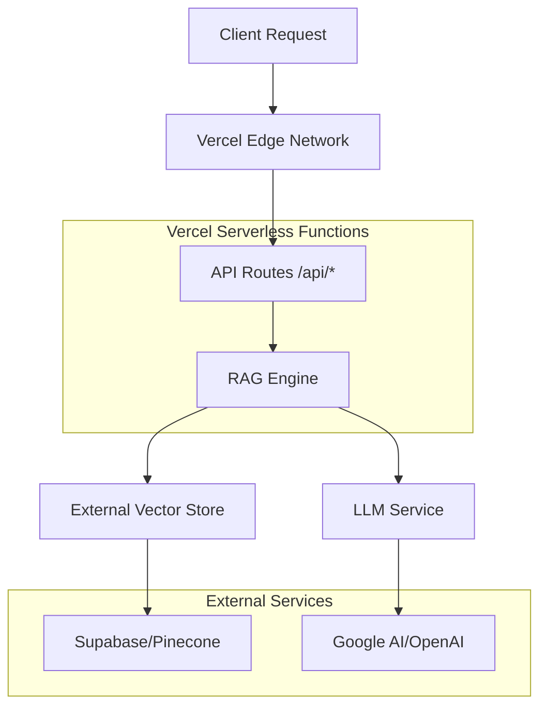

# Design Document

## Overview

This design creates a Vercel-deployable version of the advanced RAG system by adapting the existing `advanced_rag` functionality for serverless architecture. The solution addresses Vercel's constraints (cold starts, memory limits, stateless functions, timeouts) while preserving all core RAG capabilities including semantic search, conversational AI, and evidence-based responses.

The design creates a completely separate `vercel-deployment` folder structure that copies and adapts necessary components without modifying any existing files.

## Architecture

### High-Level Architecture



### Serverless Adaptation Strategy

**Problem**: Current system loads models and vector stores on startup
**Solution**: Stateless architecture with external storage

1. **Vector Store Migration**: Move from local ChromaDB to external service (Pinecone or Supabase pgvector)
2. **Model Optimization**: Use lightweight embedding models and external LLM APIs
3. **Caching Strategy**: Implement request-level caching to minimize cold start impact
4. **Configuration Management**: Environment-based configuration for different deployment stages

## Components and Interfaces

### 1. API Layer (`/api` directory)

#### `/api/search.py` - Main Search Endpoint
```python
# POST /api/search
{
    "query": "How do programs build confidence?",
    "max_results": 5,
    "filters": {
        "age_group": ["13-15", "16-18"],
        "organization": ["specific_org"]
    }
}

# Response
{
    "answer": "Based on survey data...",
    "evidence_count": 5,
    "source_documents": [...],
    "organizations": ["Org1", "Org2"],
    "age_groups": ["13-15", "16-18"],
    "processing_time": 2.3
}
```

#### `/api/health.py` - Health Check
```python
# GET /api/health
{
    "status": "healthy",
    "vector_store": "connected",
    "llm": "available",
    "last_updated": "2024-01-15T10:30:00Z"
}
```

#### `/api/chat.py` - Conversational Interface
```python
# POST /api/chat
{
    "message": "Tell me about confidence building",
    "session_id": "user_123",
    "context": []
}
```

### 2. Core Library (`/lib` directory)

#### `rag_engine.py` - Stateless RAG Logic
- Lightweight initialization
- External vector store client
- Optimized for cold starts
- Request-level caching

#### `vector_client.py` - External Vector Store Client
- Pinecone integration (primary)
- Supabase pgvector fallback
- Connection pooling
- Error handling and retries

#### `config.py` - Vercel Environment Configuration
- Environment variable management
- Service endpoint configuration
- Feature flags for different deployment stages

### 3. Vector Store Strategy

#### Option A: Pinecone (Recommended)
- **Pros**: Built for serverless, fast cold starts, managed service
- **Cons**: Additional cost, vendor lock-in
- **Implementation**: Direct API integration, no local storage needed

#### Option B: Supabase + pgvector
- **Pros**: Uses existing Supabase, cost-effective, full control
- **Cons**: Requires database migration, potential cold start delays
- **Implementation**: Extend existing Supabase schema with vector columns

#### Option C: Hybrid Approach
- **Development**: Local ChromaDB for testing
- **Production**: Pinecone for deployment
- **Migration**: Data sync utilities between systems

## Data Models

### Vector Document Schema
```python
class VectorDocument:
    id: str
    text: str
    embedding: List[float]
    metadata: DocumentMetadata

class DocumentMetadata:
    charity_name: str
    age_group: str
    gender: str
    question_text: str
    question_type: str
    response_length: int
    created_at: datetime
```

### API Request/Response Models
```python
class SearchRequest:
    query: str
    max_results: int = 5
    filters: Optional[Dict[str, List[str]]] = None

class SearchResponse:
    answer: str
    evidence_count: int
    source_documents: List[SourceDocument]
    organizations: List[str]
    age_groups: List[str]
    processing_time: float
```

## Error Handling

### Serverless-Specific Error Handling

1. **Cold Start Timeouts**
   - Implement progressive loading
   - Cache frequently used data
   - Graceful degradation for slow responses

2. **Memory Limit Exceeded**
   - Stream large responses
   - Limit result set sizes
   - Use external storage for large objects

3. **External Service Failures**
   - Retry logic with exponential backoff
   - Circuit breaker pattern
   - Fallback responses when services unavailable

4. **API Rate Limits**
   - Request queuing
   - Rate limit monitoring
   - User-friendly error messages

### Error Response Format
```python
{
    "error": {
        "code": "VECTOR_STORE_UNAVAILABLE",
        "message": "Vector search temporarily unavailable",
        "details": "Connection timeout to external service",
        "retry_after": 30
    },
    "fallback": {
        "available": true,
        "message": "Using cached responses for common queries"
    }
}
```

## Testing Strategy

### 1. Unit Testing
- Individual function testing
- Mock external services
- Edge case validation
- Performance benchmarks

### 2. Integration Testing
- End-to-end API testing
- External service integration
- Error scenario testing
- Load testing for serverless limits

### 3. Deployment Testing
- Vercel preview deployments
- Environment variable validation
- Cold start performance testing
- Production smoke tests

### 4. Performance Testing
- Response time benchmarks
- Memory usage monitoring
- Concurrent request handling
- Vector search accuracy validation

## Deployment Configuration

### Vercel Configuration (`vercel.json`)
```json
{
  "functions": {
    "api/**/*.py": {
      "runtime": "python3.9",
      "maxDuration": 30
    }
  },
  "env": {
    "GOOGLE_API_KEY": "@google-api-key",
    "PINECONE_API_KEY": "@pinecone-api-key",
    "SUPABASE_URL": "@supabase-url",
    "SUPABASE_KEY": "@supabase-key"
  },
  "build": {
    "env": {
      "PYTHONPATH": "./lib"
    }
  }
}
```

### Environment Variables
```bash
# Required
GOOGLE_API_KEY=your_google_ai_key
PINECONE_API_KEY=your_pinecone_key
PINECONE_ENVIRONMENT=your_pinecone_env
SUPABASE_URL=your_supabase_url
SUPABASE_KEY=your_supabase_key

# Optional
OPENAI_API_KEY=your_openai_key
VECTOR_STORE_TYPE=pinecone
EMBEDDING_MODEL=sentence-transformers/all-MiniLM-L6-v2
LLM_MODEL=gemini-1.5-flash
```

### Dependencies (`requirements.txt`)
```txt
# Optimized for Vercel serverless
langchain==0.1.0
langchain-google-genai==0.0.8
sentence-transformers==2.2.2
pinecone-client==2.2.4
supabase==2.3.0
fastapi==0.108.0
pydantic==2.5.3
numpy==1.24.3
python-dotenv==1.0.0
```

## Migration Strategy

### Phase 1: Setup External Vector Store
1. Choose vector store provider (Pinecone recommended)
2. Migrate existing ChromaDB data to external service
3. Test vector search functionality
4. Validate embedding consistency

### Phase 2: Create Vercel Structure
1. Create `vercel-deployment` folder
2. Copy and adapt core RAG components
3. Implement serverless-optimized versions
4. Add Vercel configuration files

### Phase 3: API Development
1. Implement API endpoints
2. Add error handling and validation
3. Create health checks and monitoring
4. Test with existing data

### Phase 4: Deployment and Testing
1. Deploy to Vercel preview environment
2. Run integration tests
3. Performance optimization
4. Production deployment

## Security Considerations

### API Security
- Environment variable encryption
- Request rate limiting
- Input validation and sanitization
- CORS configuration

### Data Security
- Secure external service connections
- API key rotation strategy
- Audit logging for sensitive operations
- Data encryption in transit

### Vercel-Specific Security
- Function timeout limits
- Memory usage monitoring
- Environment isolation
- Secure secret management